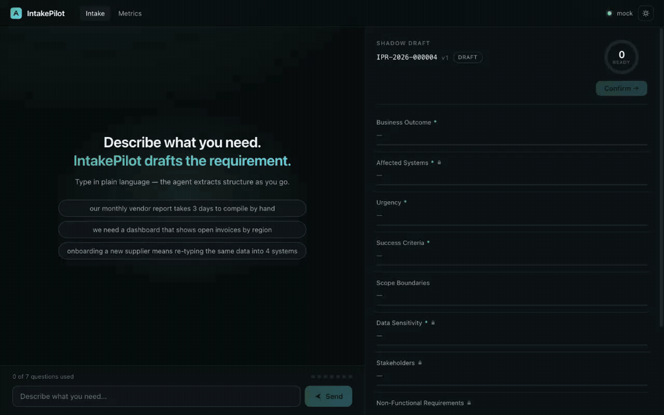
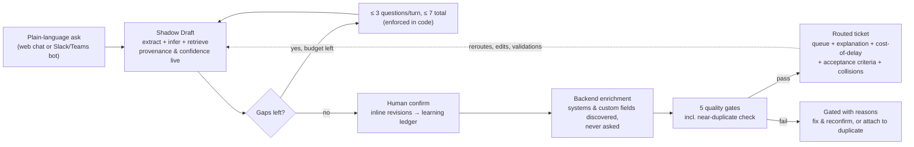
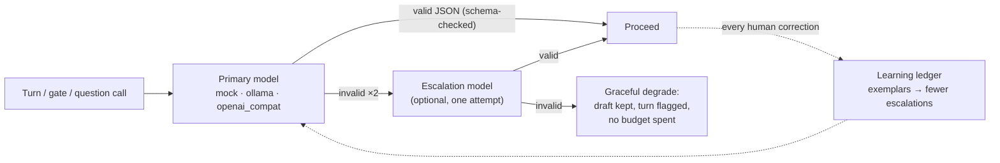
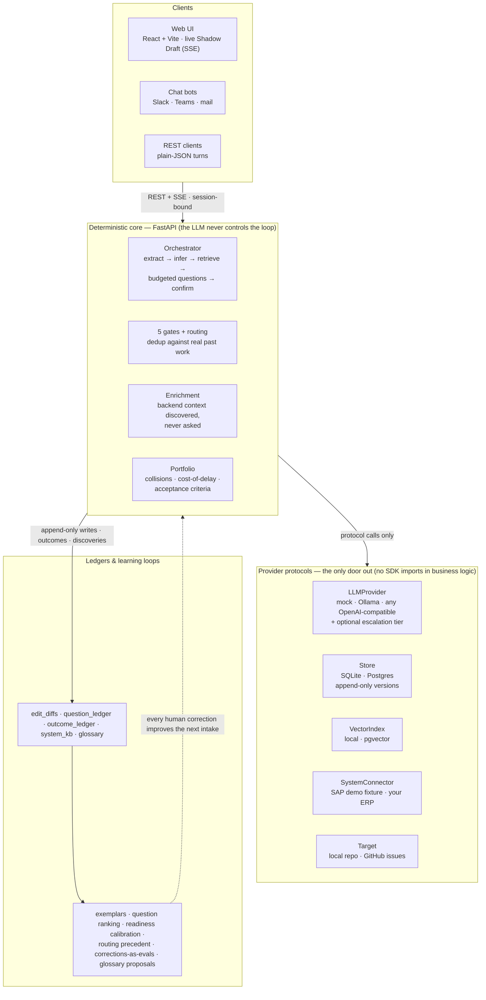

# IntakePilot

[](https://github.com/mkbhardwas12/IntakePilot/actions/workflows/ci.yml)
[](LICENSE)
[](pyproject.toml)

AI requirements-intake platform: a business user describes a need in plain
language; a deterministic orchestrator (LLM as component, never in control)
extracts structured requirement slots, resolves gaps by inference and
precedent before ever asking a question, enforces a hard question budget,
and — after human confirmation — runs a five-gate quality pipeline, routes the
requirement to the right team queue with an explanation, and creates a ticket.
Every human correction feeds a learning ledger that improves the next intake.

Built from `docs/build-specification.txt` (v1.0) plus
`docs/ADDENDUM-01-backend-aware-enrichment.md`. See `docs/SPEC-REVIEW.md`
for an honest review of the spec and the choices made where it was silent.

## Quick look

One intake, end to end — real UI, offline mock model, ~30 seconds.
**New: the Analyst read** — the ask is placed in its business process
(Order-to-Cash here), interpreted in plain language, and the analyst's
usually-left-unsaid checklist steers the interview: watch the X-ray show
questions asked *because the analyst flagged them*. Also: instant
spreadsheet checking on attach, and X-ray Intake with shareable cinematic
replays (`/r/{token}`).



*A plain-language ask becomes a live Shadow Draft with provenance badges,
an Analyst read (process badge, interpretation, open/covered checklist,
risks & measures), and an X-ray Decision Rail; analyst-flagged questions;
an attached spreadsheet is checked on the spot (title row above headers,
numbers stored as text — each with the cell ref to fix); confirm; five
gates; routed ticket. Hit **Play the 23-second demo**, then
**Share this intake**.
Launch notes: [docs/LAUNCH.md](docs/LAUNCH.md). Higher-quality video:
[docs/assets/demo.mp4](docs/assets/demo.mp4).*

## Contents

- [Quick look](#quick-look)
- [How it works](#how-it-works)
- [Who uses it, and how](#who-uses-it-and-how)
- [The five-minute first run](#the-five-minute-first-run)
- [Bring your own AI](#bring-your-own-ai)
- [Demo via curl (no UI needed)](#demo-via-curl-no-ui-needed)
- [Architecture](#architecture)
- [Backend-aware enrichment and the system knowledge base](#backend-aware-enrichment-and-the-system-knowledge-base)
- [Theming](#theming)
- [What's implemented vs. spec'd for later](#whats-implemented-vs-specd-for-later)
- [Repo layout](#repo-layout)
- [License](#license)

## How it works



1. **Describe** — a requester types (or Slack/Teams-messages) a need in
   plain language. No form, no template, no backend vocabulary.
2. **Draft** — the Shadow Draft builds live over SSE: extracted slots with
   provenance badges and confidence bars. Gaps are resolved by inference
   and precedent *before* asking anything; at most 3 questions per turn,
   7 total — enforced in code, not in a prompt. Alongside the draft, the
   **Analyst read** interprets the ask the way a seasoned BA would: it
   places the requirement in its business process (procure-to-pay,
   order-to-cash, record-to-report, …) from curated signals — never a
   model's guess — and keeps a live checklist of what requesters usually
   leave unsaid, flipping items to covered as answers land.
3. **Confirm** — the requester reviews the shakiest fields first, revises
   any field inline (every correction is captured as a learning signal),
   and confirms. Nothing routes without a human confirmation.
4. **Enrich → gate → route** — backend context (systems, tables, custom
   fields) is auto-discovered, never asked; five quality gates run
   (including near-duplicate detection against real past work); the
   requirement routes to a team queue with a written explanation, an
   annualized cost-of-delay, Given/When/Then acceptance criteria, and
   collision warnings when other open work touches the same entities.
5. **Learn** — confirmation edits, queue relabels, and KB validations feed
   append-only ledgers that recalibrate extraction exemplars, question
   ranking, readiness weights, and routing — model-agnostic learning that
   lives in data, not weights.

## Who uses it, and how

| Role | Surface | What they do |
|---|---|---|
| **Requester** | Web chat at `/loop`, or any Slack/Teams/mail bot via `POST /api/channels/inbound` | describes the need in plain words, answers ≤7 targeted questions, pencil-edits draft fields, confirms |
| **Analyst / BA** | Same UI + `GET /api/requirements/{id}/render` | reviews the plain-language render and assumption register, corrects fields at confirm — each correction trains future intakes |
| **Delivery team** | The routed ticket (local repo or GitHub Issues) | gets business intent + auto-discovered system context + acceptance criteria in one ticket; relabels the queue if misrouted (webhook feeds `routing_accuracy`); validates KB discoveries (`POST /api/kb/{system}/{entity}/validate`) |
| **Ops / admin** | `/metrics` dashboard, `GET /api/graph`, `GET /api/evals/replay`, `GET /api/glossary/proposals` | watches ROI and backlog-by-value, collision hotspots, extraction accuracy over time; accepts mined glossary terms; one env var (`INTAKEPILOT_ADMIN_TOKEN`) locks all of it |

## The five-minute first run

Zero external dependencies — no model, no Docker, no database:

```bash
git clone https://github.com/mkbhardwas12/IntakePilot.git && cd IntakePilot
make dev            # backend :8000 (mock LLM + SQLite) and web :3000
open http://localhost:3000/loop
# type: "our monthly vendor report takes 3 days to compile by hand"
# watch the Shadow Draft build, answer <= 3 questions, confirm,
# see the ticket appear in examples/demo-repo/
#
# Note: run the SAME ask twice and gate 4 will (correctly) catch the second
# as a near-duplicate of the first — click "Attach to IPR-…" to see the
# dedup flow, reword the ask, or `make clean` to reset the demo database.
```

Or run the pieces separately:

```bash
python3 -m venv .venv && .venv/bin/pip install -r requirements-dev.txt
.venv/bin/uvicorn core.api.main:app --port 8000     # backend
cd web && npm install && npm run dev                # frontend on :3000
.venv/bin/python -m pytest -q                       # tests
```

Full stack per the spec (Postgres/pgvector + Ollama + api + web):

```bash
cd deploy && docker compose up
docker compose exec ollama ollama pull llama3.1     # first start only
```

Production deployment — on-premises, air-gapped, or any cloud — uses
`deploy/docker-compose.prod.yml` (built web bundle behind nginx, env-driven
secrets, non-root API, bring-your-own LLM endpoint). Every path is documented
in `docs/DEPLOYMENT.md`; the system design lives in `docs/ARCHITECTURE.md`.

Providers are selected in `intakepilot.yaml` and can be overridden with env
vars — see [Bring your own AI](#bring-your-own-ai) for the one-line model
switch. `INTAKEPILOT_STORE=sqlite|postgres`,
`INTAKEPILOT_VECTOR=local|pgvector`; setting `DATABASE_URL` switches the
store to Postgres automatically.

## Bring your own AI

The demo runs on a deterministic mock so it works with zero setup — but the
backend is built to run **any AI you already have, enabled by environment
variables alone**. No code changes, no redeploy of anything else: set the
vars, restart the API, done. Structured outputs are schema-validated with
retry regardless of provider, so a weaker model degrades gracefully instead
of corrupting a draft.

| You want | Set | Notes |
|---|---|---|
| **Offline demo** (default) | `INTAKEPILOT_LLM=mock` | deterministic, no model, no network |
| **Local / air-gapped** (Ollama) | `INTAKEPILOT_LLM=ollama` | model per `intakepilot.yaml` (`llama3.1` + `nomic-embed-text`); `OLLAMA_BASE_URL` to point elsewhere |
| **OpenAI** | `INTAKEPILOT_LLM=openai_compat`<br/>`OPENAI_API_KEY=sk-…` | `OPENAI_MODEL` to pick the model (default `gpt-4o-mini`) |
| **Azure OpenAI / vLLM / LiteLLM / OpenRouter / TGI / llama.cpp / internal gateway** | `INTAKEPILOT_LLM=openai_compat`<br/>`OPENAI_BASE_URL=https://…/v1`<br/>`OPENAI_MODEL=…`<br/>`OPENAI_API_KEY=…` | anything that speaks `/v1/chat/completions` works; Anthropic/Gemini/Bedrock via a LiteLLM or OpenRouter gateway |
| **Hybrid: local first, frontier on hard turns** | any primary above **+** `INTAKEPILOT_LLM_ESCALATION=openai_compat` | the stronger model answers **only** when the primary fails schema validation twice — local-first economics, frontier-grade interpretation where it matters |

```bash
# example: local Ollama day-to-day, OpenAI only for the hard turns
export INTAKEPILOT_LLM=ollama
export INTAKEPILOT_LLM_ESCALATION=openai_compat
export OPENAI_API_KEY=sk-...
.venv/bin/uvicorn core.api.main:app --port 8000
curl -s localhost:8000/health   # -> "provider": "ollama+openai_compat"
```



Embeddings always stay on the primary so the vector index stays
dimensionally consistent; escalation rate is measurable at `/api/metrics`
and tapers as the learning ledger grows. Fine-grained settings (embed
models, timeouts, per-tier overrides) live in `intakepilot.yaml` under
`llm:` / `llm_escalation:`.

## Demo via curl (no UI needed)

```bash
SID=$(curl -s -X POST localhost:8000/api/sessions -H 'content-type: application/json' \
  -d '{"requester":{"name":"Demo","dept":"Finance Ops","role":"Analyst"}}' | python3 -c 'import sys,json; print(json.load(sys.stdin)["session_id"])')
curl -s -X POST "localhost:8000/api/sessions/$SID/turns?stream=false" \
  -H 'content-type: application/json' \
  -d '{"message":"our monthly vendor report takes 3 days to compile by hand"}'
# ... answer the returned questions, then confirm. Requirements are bound to
# the session that created them (IDs are sequential, so this stops enumeration):
#   curl -X POST localhost:8000/api/requirements/{req_id}/confirm \
#     -H "X-Session-Id: $SID" -H 'content-type: application/json' -d '{"edits":{}}'
```

## Architecture



`core/` is a FastAPI app. Three provider protocols (`LLMProvider`, `Store`,
`VectorIndex`) are the portability contract — no business logic imports a
provider SDK (enforced by a test). The orchestrator
(`core/agents/orchestrator.py`) is the spec's Section 6.1 loop: extract →
merge (ANSWERED/EDITED are never overwritten) → gap ladder (infer from
requester context, retrieve from glossary/precedent) → budgeted questions
(max 3/turn, 7 total, enforced in code) → stated-default assumptions →
readiness score → append-only version write. Confirmation captures every
human edit as an `edit_diffs` row (the learning asset) which
`core/learning/exemplars.py` injects into future extraction prompts —
model-agnostic learning. Gates 1/3 are deterministic pure functions; gates
2/4/5 use the LLM as a scored rubric behind one validate-and-retry wrapper.
The routing classifier blends configured keyword signals with routed
precedent from the vector index, plus confidence and a human-readable explanation. `web/` is a React + TypeScript + Vite app that
consumes the SSE turn stream to animate the Shadow Draft live.

The full design — component map, complete API surface with the auth model
per endpoint, trust boundaries — lives in
[docs/ARCHITECTURE.md](docs/ARCHITECTURE.md); every deployment path
(laptop → docker → air-gapped prod) in
[docs/DEPLOYMENT.md](docs/DEPLOYMENT.md).

## Backend-aware enrichment and the system knowledge base

Business users never need to know backend details (ADDENDUM-01). After a
requirement is confirmed — and before gates/routing — an enrichment step
(`core/agents/enrichment.py`) resolves the business terms in the ask through
the glossary and a `SystemConnector` provider
(`core/providers/connector/`, protocol: `resolve_entity` /
`describe_entity` / `list_customizations`). The shipped `fixture` connector
reads YAML system definitions from `core/schemas/systems/` — an example SAP
S/4HANA system (sales orders `VBAK/VBAP` with Z-fields like
`ZZ_PRIORITY_CODE`, material master `MARA` with append fields) and a non-SAP
Postgres fulfillment DB with custom columns.

What the enrichment produces:

- A `backend_context` slot (provenance `retrieved`, `askable: false` — the
  Question Composer can never ask the requester about backend detail; an
  invariant test enforces it) holding the matched entities, their backend
  names, and every customization with type, description, and owner.
- A **System context (auto-discovered)** section on the routed ticket, so
  the assigned team sees e.g. `ZZ_PRIORITY_CODE` without re-interrogating
  the requester — try the ask *"I need a report of goods details for product
  line X with the order info"*.
- Rows in the `system_kb` ledger (entity schema, `evidence_count`,
  `verified`, `last_refreshed`, embedded into the vector index). The
  retrieval ladder reads `system_kb` on later intakes, so affected systems
  and backend context are pre-filled from cached discoveries; discoveries
  start `unverified` and are promoted via `mark_validated` when a human
  confirms them. `/api/metrics` reports entity/customization/verified counts.

Swap the fixture for a real connector (SAP OData/RFC, database catalog) by
implementing the three-method protocol and pointing `intakepilot.yaml`
(`connector:` / `connectors:`) at it.

## Theming

The UI follows `docs/DESIGN-GUIDELINES.md`: every color flows through
semantic CSS custom properties in `web/src/styles.css`, with first-class
**dark and light themes** selected by `html[data-theme]`. The header toggle
persists the choice to `localStorage`; the default follows the OS
`prefers-color-scheme` (applied pre-paint by an inline script in
`web/index.html`, so there is no flash). Accents are teal/cyan — no
purple/violet/indigo anywhere — with amber for warnings, red for failures,
green for success, and a distinct badge color per provenance value.

## What's implemented vs. spec'd for later

Implemented and verified (spec milestones 1–5 core, plus gates/routing from 6):

- Pydantic model per spec 4.1; slot schema loader with the `askable:false` rule (4.2)
- Providers: mock (deterministic, offline), Ollama, OpenAI-compatible, plus
  an optional escalation tier (`EscalatingLLM`: a stronger model answers
  validation-failed turns — the hybrid local/cloud strategy); SQLite
  (default) and Postgres (4.3 DDL) stores, both append-only; local cosine
  vector index and pgvector
- The full 6.1 turn loop with SSE streaming, budget enforcement, gap ladder,
  defaults with reasons, readiness scoring (rubric documented in
  `core/agents/orchestrator.py` — the spec omits one)
- Confirmation with edit-diff capture, exemplar selection/injection (7.2)
- Five-gate pipeline (1 & 3 deterministic; 2/4/5 LLM-rubric), routing
  classifier with explanation, ticket targets: local repo (default),
  GitHub issues, or Jira Cloud via `provider.target` / `INTAKEPILOT_TARGET`
- `/api/metrics` computing Section 9 metrics from the ledgers (plus
  system-KB counts, escalation rate, duplicate catch rate, and routing
  accuracy from reroute ground truth)
- Request-type schema forks (bug_report / data_request classified
  deterministically on the first turn; forks in `core/schemas/*.yaml`, learning
  buckets are dept×type), an opt-in dynamic question budget scaled by blast
  radius (`budget.dynamic`), and a generic chat-channel adapter
  (`POST /api/channels/inbound`) any Slack/Teams bot can call — numbered
  answers and a 'confirm' keyword complete the whole flow in chat
- The portfolio layer: collision detection (open requirements touching the
  same backend entities are connected at confirm — ticket Impact section,
  `GET /api/graph` with hotspots), deterministic cost-of-delay pricing on
  every ticket (`cost_of_delay` slot + backlog-by-value in metrics),
  generated Given/When/Then acceptance criteria on routed tickets, and a
  stakeholder countersign ledger (`/api/requirements/{id}/consent`)
- The learning & feedback surface: gate 4 checks real known work (vector
  candidates + deterministic near-duplicate fail) with one-click
  attach-as-duplicate; routing blends keyword and precedent signals and
  learns from reroutes (`POST /api/requirements/{id}/reroute`, GitHub
  webhook); question ranking and readiness weights calibrate from the
  ledgers; corrections replay as evals (`GET /api/evals/replay`); repeated
  corrections surface as glossary proposals (`GET /api/glossary/proposals`,
  human-accepted via `POST /api/glossary`); system-KB validation via
  `POST /api/kb/{system}/{entity}/validate`
- The Analyst read (`core/agents/analyst.py` + `core/knowledge/processes.yaml`):
  every interactive turn, the ask is placed in an end-to-end business process
  by deterministic signal matching against a curated, forkable taxonomy —
  which brings a BA's obligations with it: unstated needs (statused live
  against the slots that would settle them), classic risks, and the KPIs the
  business will judge the work by. The plain-language interpretation is the
  one LLM-composed part (validated, deterministic fallback); it is advisory
  by construction — nothing in it feeds slots, routing, gates, or the budget.
  Streamed as an `analyst` SSE event, shown in the draft column, included in
  the confirm render. The taxonomy learns from production: every confirm
  logs what the analyst believed, recurring vocabulary the taxonomy is
  missing surfaces as proposals (`GET /api/analyst/proposals`), and a human
  accept (`POST /api/analyst/signals`) makes the term a recognition signal —
  mined from data, human-approved, never auto-applied. The checklist is
  predictive, not just curated: needs that stayed open in requirements later
  adjudicated as missing the mark carry a "missed ×N" evidence badge and
  sort first. And open needs actively steer the interview — a need whose
  covering slot is askable and empty competes for question slots
  (deterministically, always after required gaps, never widening the budget)
- MANAS demand-lobe outbox, wired (default-off, `MANAS_OUTBOX_ENABLED=true`
  plus the `MANAS_*` binding and tenant pepper): confirming a routed
  requirement commits an `io.manas.demand.requirement.versioned.v2` envelope
  to a transactional outbox table alongside the domain write — an HMAC
  commitment to the intent, never the business narrative itself; the new
  human adjudication endpoint (`POST /api/requirements/{id}/adjudicate`,
  verdict achieved/partially_achieved/not_achieved by a business or product
  owner) records the terminal judgement locally and, when the delivery
  system's deployment attestation is presented, emits
  `outcome.adjudicated.v1`. The outbox is honestly transactional: the
  requirement version and its envelope commit in one SQL transaction
  (`put_version_with_outbox`, both stores), so a crash can never separate
  the version from its event. The relay ships it the last mile —
  `python -m core.export.manas_outbox.relay` (cron) or
  `POST /api/export/outbox/ship`, authenticated via `MANAS_RELAY_URL` +
  `MANAS_RELAY_TOKEN`: 2xx stores the MANAS receipt verbatim, 4xx
  dead-letters immediately (contract rejections don't retry), 5xx/transport
  errors retry across passes until the attempt budget dead-letters them;
  every attempt is an append-only row. Manual read/ack stays available via
  `GET/POST /api/export/outbox`; misconfiguration becomes an auditable
  rejected row, never a failed confirm
- Attachment validation (`core/attachments/` +
  `POST /api/sessions/{id}/attachments`, paperclip in the intake chat): a
  streaming, stdlib-only `.xlsx` reader (no size/row/cell-length caps,
  zip-bomb and XXE guarded) inspects structure — title rows above headers,
  duplicate/blank headers, `#REF!` errors, numbers or dates stored as text,
  hidden tabs with data — and checks the columns against the fields the
  requirement itself named (`data_fields`), returning a verdict with the
  exact cell to fix in the requester's own words
- ADDENDUM-01 backend-aware enrichment: `SystemConnector` protocol + fixture
  connector, post-confirm enrichment agent, `system_kb` ledger feeding the
  retrieval ladder, System-context section on routed tickets and in the
  confirm/post-confirm UI
- Web UI: chat with streaming + question chips + budget meter, live Shadow
  Draft with provenance badges and confidence bars, **X-ray Decision Rail**
  (live gap-ladder `decision` SSE events), one-click 23s demo, readiness ring,
  confirm view with inline edits and assumption register, gate/routing/ticket
  results with collision constellation + **Share this intake** (`/r/{token}`
  cinematic replay + OG card), triage queue, metrics dashboard with glossary
  proposal inbox — all themed dark/light via semantic tokens
- Public demo compose (`deploy/docker-compose.demo.yml`), rate limits, share
  abuse caps, structured request logs; seed cold-start shares via
  `python -m scripts.seed_shares`
- Tests for the Section 11 invariants plus the ADDENDUM-01 invariants and
  acceptance scenario (`tests/`)

Spec'd for later (honest gaps):

- Milestone 6 remainder: triage queue UI (GitHub + Jira targets, label-reroute
  webhooks and the Jira issue-done -> delivered outcome sync are shipped;
  full bidirectional status sync is not). **Triage UI ships** at `/triage`.
- Milestone 7 remainder: nightly distillation jobs, `prompt_configs`
  promotion gate (the 40-scenario golden harness ships: `python -m
  evals.harness` scores any provider; invariants gate every test run)
- Milestone 8: precedent backfill from targets, glossary importer CLI
  (a seed glossary ships for the demo; **clone-and-modify** ships from
  share replay + triage)
- Milestones 9–10: Bedrock/DynamoDB/Bedrock-KB providers, SAM template,
  Builder Agent
- Auth/multi-tenancy (session binding + admin token + webhook signature are
  shipped; end-user SSO is your reverse proxy's job for now), schema
  migrations — see `docs/SPEC-REVIEW.md`. Public demo posture:
  `docs/LAUNCH.md` + `deploy/docker-compose.demo.yml`.

## Repo layout

Matches spec Section 3: `core/` (api, agents+prompts, attachments, gates,
knowledge, learning {exemplars, proposals, replay},
providers/{llm,store,vector,connector},
targets, schemas, models.py, config.py), `web/`, `deploy/` (docker-compose +
Dockerfiles + nginx), `scripts/` (ops_check.py live-API readiness sweep),
`tests/` (invariants, e2e, golden set, per-feature suites), `evals/golden/`,
`docs/`, `examples/demo-repo/`.

## License

[MIT](LICENSE)
