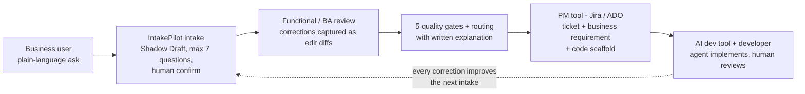

# IntakePilot Architecture

IntakePilot is an AI requirements-intake platform built on one non-negotiable principle: **the orchestration is deterministic code; the LLM is a component, never in control.** Budgets, merge rules, status transitions, and quality gates live in Python, are enforced at runtime, and are pinned by adversarial tests. The model only proposes; code disposes.

## The end-to-end workflow

A business user describes a need in plain language. IntakePilot builds a structured requirement live (the Shadow Draft), resolves gaps by inference and precedent *before* asking anything, and asks at most 3 questions per turn, 7 total — enforced in code, not in a prompt. After the human confirms, an enrichment step auto-discovers backend context (systems, tables, custom fields) so the requester is never asked a technical question, five quality gates run, and the requirement is routed to the right team queue with a written explanation and a ticket.

From there the flow extends into the delivery chain: the ticket lands in a project-management tool (Jira, Azure DevOps — the `Target` protocol makes this a one-class integration) carrying **two artifacts: the structured business requirement and a generated implementation scaffold.** An AI coding agent can consume that enriched ticket directly; a developer reviews and ships. Everyone in the chain — requester, business analyst (optional), functional reviewer, tech lead, developer — sees the *same* requirement, each in their own rendering.

The loop closes through the learning ledger: every human correction at confirmation is captured as an `edit_diffs` row and re-injected as an exemplar into future extraction prompts. The system gets better with use, with any model, because the learning lives in data, not in fine-tuned weights.

## Core design decisions

**Provider protocols are the portability contract.** Three (plus one) small Python protocols — `LLMProvider`, `Store`, `VectorIndex`, `SystemConnector` — isolate every external dependency. No business logic imports a provider SDK; a test fails the build if one does. This is what makes the same codebase run against a mock model on a laptop, Ollama in an air-gapped data center, or any OpenAI-compatible endpoint (vLLM, LiteLLM, Azure OpenAI) in the cloud, with SQLite or Postgres/pgvector underneath. See `docs/DEPLOYMENT.md`.

**Model strategy: any model, tiered, smarter every day.** Interpreting what a business user *means* takes real model capability — a small local model alone may not be enough on day one. IntakePilot therefore treats intelligence as a deployment choice, not an architectural one, on three axes. First, the primary model can be anything with an OpenAI-compatible or Ollama API — cloud frontier, hosted open-weight, or fully local. Second, an optional **escalation tier** (`EscalatingLLM`) gives hard turns exactly one attempt on a stronger model when the primary's structured output fails validation twice: local-first token economics, frontier-grade interpretation where it matters, and embeddings pinned to the primary so the vector index stays consistent. Third — and most important — the **learning ledger closes the gap through daily usage**: every human correction becomes an exemplar injected into future extraction prompts, and the glossary/precedent/system-KB retrieval ladder supplies the org-specific context no frontier model has. Interpretation quality comes less from raw model IQ than from *your* accumulated context — which is exactly the part that never has to leave your network. In practice teams can start with a stronger escalation endpoint doing more of the work and watch escalations taper as the ledger grows.

**The turn loop (spec §6.1) is a pure sequence:** extract → merge (ANSWERED/EDITED slots are never overwritten) → gap ladder (infer from requester context, then retrieve from glossary/precedent/system-KB) → budgeted questions → stated-default assumptions → readiness score → append-only version write. Extraction failures degrade gracefully: the draft is kept, the turn is flagged, no budget is spent.

**Questions are a last resort, and never technical.** Slots marked `askable: false` in the schema (affected systems, data sensitivity, backend context) can only be inferred, retrieved, or defaulted — the Question Composer cannot ask them, and an invariant test proves it. This is the "no engineering questions to business people" rule as a one-line schema flag.

**Backend-aware enrichment (ADDENDUM-01).** After confirmation, the `SystemConnector` resolves the business terms in the ask to real backend entities — the shipped fixture models an SAP S/4HANA system (sales orders `VBAK/VBAP` with Z-fields like `ZZ_PRIORITY_CODE`, material master `MARA` append fields) and a non-SAP Postgres fulfillment DB. Discovered entities and customizations land on the routed ticket ("System context (auto-discovered)") and in the `system_kb` ledger, which pre-fills future intakes. Swap in a real SAP OData/RFC or database-catalog connector by implementing three methods.

**Gates are Jidoka, not vibes.** Gates 1 (schema) and 3 (ambiguity lint with a concrete-anchor check) are deterministic pure functions; gates 2/4/5 (INVEST, conflict, routing sanity) use the LLM as a scored rubric behind a single validate-and-retry wrapper. Failures never mutate the object — they park it as GATED with reasons and suggestions.

**The portfolio layer.** Confirmation doesn't just finish one requirement — it checks it against all open work. Collision detection intersects auto-discovered backend entities across requirements (two different asks touching `sales_order` are connected on the spot: response, audit trail, ticket Impact section, `GET /api/graph` hotspots). Cost-of-delay pricing turns duration × cadence from the requester's own words into an annualized number on the ticket and a backlog-by-value view in metrics — deterministic arithmetic, never an LLM guess. Routed tickets carry generated Given/When/Then acceptance criteria (the validated-LLM wrapper, degrading gracefully), and named stakeholders get countersign records (`/api/requirements/{id}/consent`) so objections land before the build, not after UAT.

**Everything is a ledger.** Requirement versions are append-only (enforced by primary key), and `edit_diffs`, `question_ledger`, `outcome_ledger`, `glossary`, and `system_kb` accumulate the operational history that `/api/metrics` computes Section-9 metrics from — questions per intake, edit rate per field, assumption rate, analyst hours displaced.

## Repository layout

`core/` — FastAPI app: `api/` (routers), `agents/` (orchestrator, intake, gap analyzer, question composer, enrichment, renderer), `gates/`, `learning/` (exemplars), `providers/` (llm, store, vector, connector), `targets/`, `models.py`, `config.py`. `web/` — React + TypeScript + Vite, SSE streaming UI, semantic-token theming (dark/light). `deploy/` — dev and prod compose files, Dockerfiles, nginx config. `tests/` — invariant, e2e, enrichment, portfolio, and API suites (100+ tests). `evals/golden/` — golden intake scenarios. `docs/` — build spec, addendum, spec review, design guidelines, deployment, this file.

## Trust boundaries and current limits

There is **no end-user SSO yet** — requirements are bound to their creating session (`X-Session-Id`, anti-enumeration 404s), one bearer token (`INTAKEPILOT_ADMIN_TOKEN`) closes every admin/ops surface, and the GitHub webhook verifies `X-Hub-Signature-256` — but user identity remains your reverse proxy's job (`docs/DEPLOYMENT.md`, security checklist). Multi-tenancy, the Jira/ADO target, the full 40-scenario eval harness, and the Builder Agent (the component that will attach generated code scaffolds to tickets automatically) are specified in the build spec's later milestones; `PROJECT-REVIEW.md` tracks the honest gap list.
