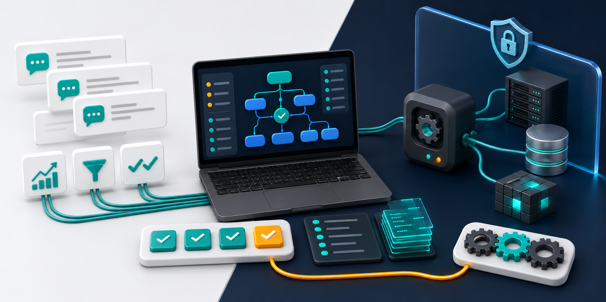
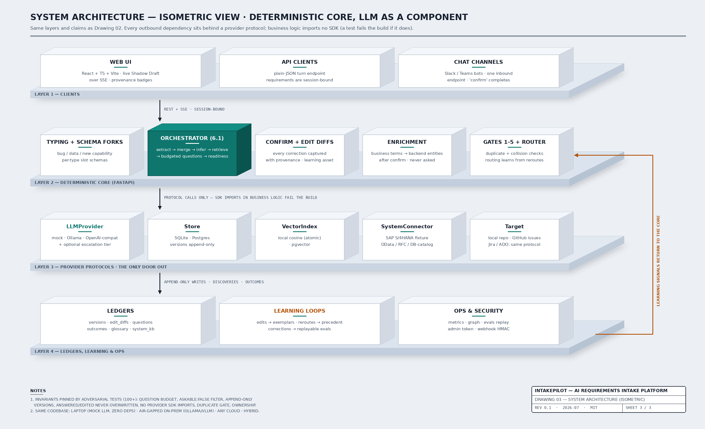
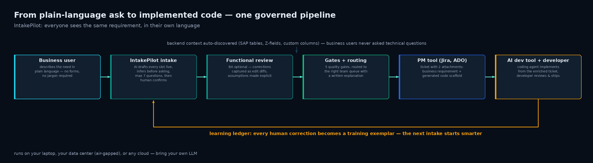

# IntakePilot: local-first AI intake that turns messy asks into code-ready requirements

*A business user starts with one sentence. IntakePilot turns it into a structured, quality-gated, routed requirement, with deterministic orchestration and a local-first architecture.*



Why do projects with a clear BRD still deliver the wrong thing? Because the hardest part of enterprise delivery is rarely the code. It is getting one requirement to mean the same thing to five people: the requester, the business analyst, the functional team, the architect, and the developer.

The scene repeats across the industry, at no particular company — it is simply how large-scale delivery is structured everywhere, and it has nothing to do with talent. Picture it: a finance analyst says, in perfectly clear English, "our monthly vendor report takes 3 days to compile by hand." A BA turns that into a BRD — carefully, and usually well. A functional consultant reads the BRD through the lens of the modules they own. An architect scopes it against the platform. A developer implements the scoped version. Five hand-offs, five honest interpretations, and each one closes a real gap for the next person. Nobody is the villain here. The drift is structural: meaning leaks a little at every well-intentioned translation, and there are no spare hands to chase every follow-up, record every clarification, and keep the document aligned with what was actually said.

Most teams do not need another blank template. They need the intake conversation to stay alive as structured evidence: what was said, what was inferred, what was assumed, what was corrected, what system context was discovered, and why the work was routed where it was.

That is the job of IntakePilot.

I have gained a lot from this community over the years. Open-sourcing IntakePilot is one small way of giving back.

GitHub: [github.com/mkbhardwas12/IntakePilot](https://github.com/mkbhardwas12/IntakePilot)

## The product idea

IntakePilot starts with a plain-language ask:

> our monthly vendor report takes 3 days to compile by hand

Before asking anything, it builds a live Shadow Draft: business outcome, stakeholders, affected systems, assumptions, confidence, provenance, and readiness. It asks only the missing business questions, with the question budget enforced in code rather than trusted to a prompt.

After the human confirms the requirement, IntakePilot runs enrichment and quality control:

- backend-aware enrichment resolves business terms to system context
- five gates check schema quality, INVEST quality, ambiguity, duplicates, and routing sanity
- routing selects a team queue and writes down why
- the ticket preserves the original ask verbatim
- every inferred, answered, assumed, and edited slot carries provenance
- corrections become future learning examples instead of disappearing into chat history

The rule underneath all of this is deliberately strict:

**The LLM proposes. Deterministic code decides.**

The model can suggest structured output, questions, acceptance criteria, and rubric scores. It does not own the budget, overwrite human edits, mutate confirmed facts, or decide whether a requirement passes a deterministic invariant.

## Who does what, in plain words

If the sections below get technical, here is the whole thing as a day at the office.

**The business user** — say a finance analyst — types what she needs the way she would say it to a colleague: "our monthly vendor report takes 3 days to compile by hand." The tool asks at most seven short questions, in business language. She watches the request take shape beside the chat, fixes anything it misunderstood, and clicks confirm. Total effort: a few minutes, once. She is never asked which database anything lives in — that is the tool's homework, not hers.

**The business analyst** (optional — bigger asks deserve one) opens the same request and sees three kinds of statements, each labeled: what the requester actually said, what the tool inferred from past requests, and what it assumed. The BA corrects whatever is off. Every correction is remembered, so next month's similar request arrives pre-corrected. The BA starts from a solid draft instead of a blank template, and their time goes into judgment instead of collection.

**The functional reviewer or product owner** receives the request with the homework attached: which systems it touches (discovered automatically), what doing nothing costs in hours per year (computed from the requester's own words), whether any other open request touches the same objects, and a done-checklist in given/when/then form. Priority conversations happen over numbers on the page rather than gut feel.

**The delivery team and developer** find a ticket in the tool they already use — GitHub or Jira — carrying the original ask word for word, the discovered system context, and the acceptance checklist. If the ticket landed with the wrong team, they simply relabel it; the router learns from that and gets it right next time. When they close the ticket, the system records the delivery, so the benefit numbers are measured, not claimed.

**Setting it up** is IT work, not a project: one small web application running inside your own network. Pick where tickets land (GitHub or Jira), pick which AI answers (a built-in offline one for trying it out, any model your company allows for real use), and put it behind your company sign-in. Nobody's job changes. The paperwork between the jobs is what changes.

## From one sentence to a developer's diff

The chain IntakePilot is built around looks like this.

A requester describes the need in their own words, in the web UI or through a Slack/Teams adapter. If a business analyst joins the loop — and on bigger asks they should — their corrections are not side conversations that evaporate: every edit at confirmation is captured as a structured diff with provenance, which is exactly the material the system learns from. A functional reviewer sees the same object the requester produced, original ask preserved verbatim, every inference labeled as an inference, and confirms or corrects it in minutes, with the context already on the page.

On confirmation the requirement is enriched with discovered backend context, gated, priced, and routed. The routed ticket is designed to land in the project-management tool carrying two artifacts: the structured business requirement, human-readable with its full provenance trail, and a generated implementation scaffold that an AI coding tool can consume directly. The developer implements against a requirement that carries its own context, instead of reconstructing intent from a ticket format that never had room for it.

Where that stands today: tickets emit to a local repo, GitHub issues, or Jira Cloud through the `Target` protocol, and they already carry the requirement, Given/When/Then acceptance criteria, auto-discovered system context, an impact section, and a cost-of-delay figure. Closing a Jira ticket even reports back, so delivery is recorded, not assumed. Azure DevOps is the same one-class integration, next on the list. The Builder Agent, the piece that attaches the code scaffold automatically, is specified in the build plan's later milestones. The contract that matters is enforced now: everyone in the chain reads the same requirement, each in their own rendering, and nothing silently rewrites it.

## The shipped architecture



*The full engineering sheet, same layers with more detail, lives in the repo as `docs/assets/architecture.png`.*

The frontend is a React + TypeScript + Vite app. It streams the intake loop over Server-Sent Events so the requester sees the draft evolve as answers arrive. The UI includes the chat, question chips, readiness, provenance badges, confirmation edits, gate results, routing explanation, and metrics surfaces.

The backend is a FastAPI app. The orchestrator owns the core loop:

1. extract structured slots from the ask
2. merge without overwriting human-answered or human-edited slots
3. fill gaps from requester context, glossary, precedent, and system knowledge
4. ask budgeted business questions
5. add stated-default assumptions
6. compute readiness
7. write append-only versions
8. confirm, enrich, gate, route, and emit the ticket

Provider protocols isolate every external dependency:

- `LLMProvider` for mock, Ollama, OpenAI-compatible endpoints, and optional escalation
- `Store` for SQLite or Postgres
- `VectorIndex` for local cosine search or pgvector
- `SystemConnector` for backend/entity discovery
- `Target` for local repo output today and issue trackers as the integration boundary

No business logic imports a provider SDK; a test fails the build if one does. That means the same code path runs in a five-minute local mock demo, on a laptop with Ollama, on an internal GPU server, or against a governed OpenAI-compatible endpoint.

## Whose AI? Yours

Token economics decide more AI architecture than anyone admits. An intake conversation is chatty: extraction, gap analysis, question ranking, rubric scoring, acceptance criteria. Pay frontier-API prices for every one of those calls, multiplied by every requirement in a large organization, and the pilot that looked cheap in a demo becomes a line item that gets cut. Run the same calls on your own hardware and the marginal cost of a smarter intake rounds to electricity.

Cost is the smaller half of the argument. Requirements are some of the most sensitive text an enterprise produces: they describe what is broken, what is planned, and where the competitive edges are. Plenty of companies, especially in the SAP world where staying on-premise is a deliberate strategy rather than a lag, will not send that text to an external API — and should not have to. IntakePilot treats that as a first-class deployment, not a compromise: Ollama or vLLM inside your network, SQLite or Postgres underneath, nothing leaves.

Enabling whichever model you are allowed to use is configuration, not integration work. Set the endpoint, the API key, and the model name in environment variables, restart, and `/health` reports which model is answering. If your model policy changes next quarter, you change three variables and nothing else. Structured outputs are schema-validated with retry regardless of provider, so switching models never risks a corrupted draft.

There is also a hybrid mode for the honest day-one problem: a small local model may not be smart enough yet. An optional escalation tier gives hard turns exactly one attempt on a stronger model, but only after the primary's structured output fails validation twice. Local-first economics, frontier-grade interpretation where it matters. And because the learning lives in ledgers rather than weights, escalations taper as the system accumulates your organization's context — the part no frontier model has and no model swap erases. Tests pin all of it: every provider, including the escalation pair, can be enabled from environment variables alone.

## Why backend-aware enrichment matters

Business users should not be asked technical questions they cannot reasonably answer.

In IntakePilot, schema slots can be marked `askable: false`. The question composer is not allowed to ask those slots, and tests enforce that rule. Backend context is resolved after confirmation through the system connector.

The demo connector ships with SAP-style and database-style fixtures. A business phrase like "order info" can resolve to entities such as `VBAK`, `VBAP`, material master data, custom fields, descriptions, and owning teams. That context lands on the routed ticket without turning the requester into a system analyst.

This is especially important for SAP and other deep enterprise systems, where the business word and the backend object are rarely the same thing.

## The portfolio layer



One requirement is useful. The portfolio view is where the system gets more interesting.

Because confirmed requirements carry backend context, IntakePilot can detect when two different asks touch the same underlying entity. That is not necessarily a duplicate. It is a coordination signal. The system shows that two open requirements both touch the same sales-order object before the collision appears in implementation, testing, or production — on the confirmation response, on the ticket's impact section, and in a hotspot view at `/api/graph`.

The delay gets a price, deterministically. "Takes 3 days by hand, every month" in the requester's own words becomes arithmetic, never an LLM guess: 3 days × 12 months is 288 hours a year of someone's working life, printed on the ticket and driving a backlog-by-value view in metrics. Prioritization gets a shared number to discuss instead of competing impressions.

Each routed ticket also carries generated Given/When/Then acceptance criteria (validated LLM output that degrades gracefully when the model cannot produce it), and named stakeholders get a countersign record via the consent endpoint — so objections land before the build, not after UAT.

## The learning loop

The ledgers make improvement explicit:

- edit diffs become future extraction examples
- reroutes teach routing precedent
- repeated corrections become glossary proposals
- question outcomes influence asking order
- corrections replay as evals, so you can measure whether today's stack would still make yesterday's mistakes
- metrics compute throughput, duplicate catches, routing accuracy, system-KB coverage, and backlog value

None of this makes the AI the author of your requirements. Humans stay the authors. The system does the bookkeeping nobody has spare hands for: recording who changed what and why, keeping the document aligned with what was actually said, and replaying those corrections so the next intake starts smarter. The learning lives in data, not fine-tuned weights — swap the model later and the operating memory stays.

## How I know it works

I distrust demos, including my own, so the repo carries its own evidence. There are 125 backend tests, and they are not ceremony: adversarial suites try to trick the orchestrator into overspending the question budget, overwriting a human's answer, or routing without a confirmation — the invariants hold because tests pin them, not because a prompt asks nicely. A separate live probe (`scripts/ops_check.py`) runs 31 end-to-end checks against a running API: request-type classification, budget exhaustion, duplicate-detection-then-attach, forged-input rejection, hostile strings through the whole confirm path, and the ops endpoints. TypeScript builds clean, `npm audit` reports zero vulnerabilities, and both Docker Compose paths validate.

My favorite test failure so far: on its second run, the ops probe "failed" two checks — because the learning loops had already absorbed the first run's data and stopped asking questions the precedent could answer. The product outsmarted its own test. I made the probe learning-aware and kept the lesson.

In plain words, for non-developers: every time the code changes, a robot user replays about forty realistic requests — bug reports, data requests, new ideas, one deliberately vague ask, and two in German — through the entire journey from typed sentence to routed ticket, and the run fails loudly if any promise breaks: never more than seven questions, never a technical question to a business person, never a machine overwriting a human's answer, never routing without a human's confirmation. And what is deliberately not in the box yet, so nobody is surprised in a pilot: its own login screen (your IT fronts it with company sign-in), serving multiple separate companies from one install, Azure DevOps tickets, and the automatic code-scaffold attachment. Those are on the roadmap, in the open.

## The whole system in one picture


Plain-language asks enter from the light side. The draft builds live under a deterministic orchestrator. Gates catch what should not pass — the amber tile is the point, not a failure. The ticket and its ledgers accumulate. Everything on the dark side, model included, is your own infrastructure behind your own boundary. And the single amber cable is every correction flowing back to make the next intake smarter.

## How you can use it for your own use case

Map it to whatever your intake pain looks like.

**If your team drowns in report and data requests** — point requesters at the chat instead of your inbox. You get deduplicated, prioritized requests with the fields your data team actually needs (sources, refresh cadence, sensitivity), and a backlog sorted by hours saved per year.

**If bugs arrive as chat messages** — the same door recognizes a bug on the first sentence and captures what is broken versus what should happen, so triage starts from facts instead of a reconstruction.

**If you run SAP or any deep platform** — teach it your vocabulary once (the glossary and system connector are plain YAML plus a three-method interface), and every future request arrives with tables, custom fields, and owning teams already attached.

**If you are piloting AI coding tools** — this is where development genuinely speeds up. An agent is only as good as the ticket you hand it; these tickets carry the business intent verbatim, given/when/then acceptance criteria, and discovered system context — exactly the inputs a coding agent needs to produce a useful first version instead of a guess. Fewer clarification loops, less rework, faster from ask to diff.

**If your teams, fields, and queues look different** — everything that varies is configuration: slot schemas are YAML files you can extend per request type, routing queues and their keywords are one config block, and the golden-scenario harness lets you replay your own real requests as a test before rolling anything out.

Adapting it is a config exercise first, and a coding exercise only at the edges.

## How to try it

The fastest path uses the deterministic mock model and SQLite:

```bash
git clone https://github.com/mkbhardwas12/IntakePilot.git
cd IntakePilot
make dev
open http://localhost:3000/loop
```

Try:

```text
our monthly vendor report takes 3 days to compile by hand
```

For the full local stack:

```bash
cd deploy
docker compose up
docker compose exec ollama ollama pull llama3.1
```

Production deployment is documented in `docs/DEPLOYMENT.md`, with local-LLM and bring-your-own-endpoint paths.

## What is next

The current implementation is intentionally honest about its limits. End-user SSO and multi-tenancy are not done. Jira and Azure DevOps targets are the next natural integrations. A fuller eval harness and the builder-agent scaffold are planned.

But the important foundation is working: a deterministic intake orchestrator, local-first model options, backend-aware enrichment, append-only learning ledgers, quality gates, routing explanations, portfolio-level collision and value signals, and tests around the invariants.

For me, the interesting question is not whether an LLM can write a requirement. It is whether we can use AI to keep everyone aligned around the requirement humans actually mean.

That is what IntakePilot is trying to do.

---

*IntakePilot is a personal, open-source side project (MIT). The scenarios in this article are generic composites of how enterprise delivery works at scale, drawn from the industry as a whole — they do not describe any specific employer, client, colleague, or project.*
