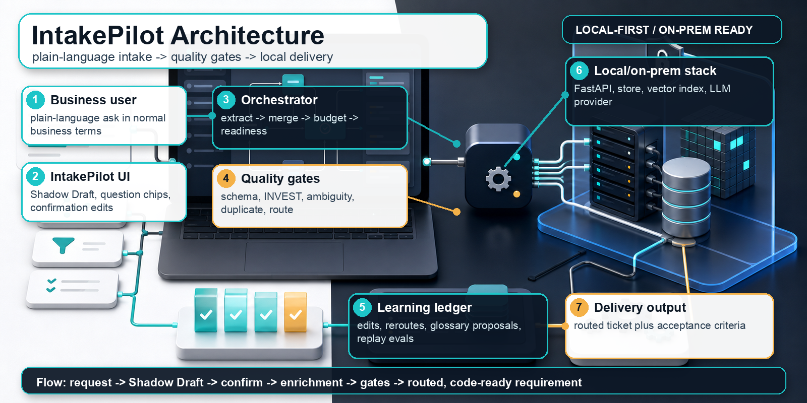
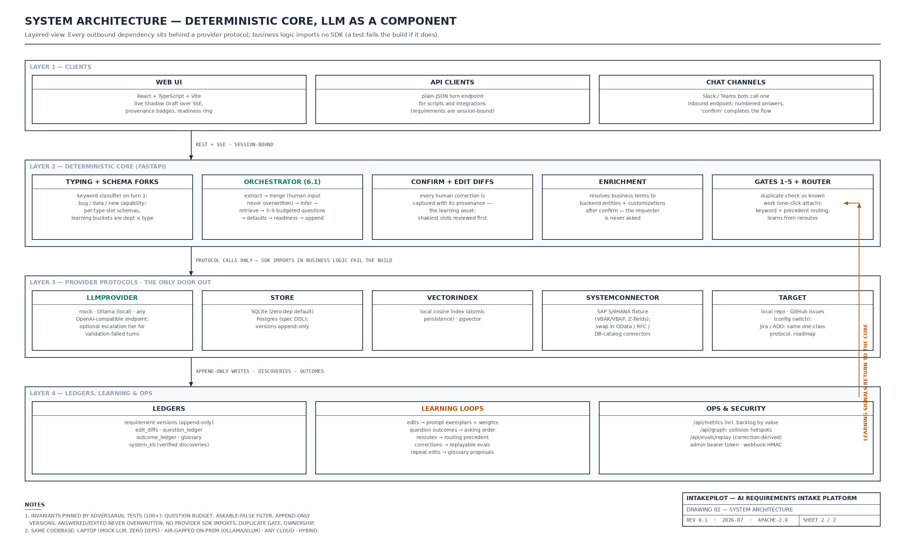

# IntakePilot: local-first AI intake that turns messy asks into code-ready requirements

*A business user starts with one sentence. IntakePilot turns it into a structured, quality-gated, routed requirement, with deterministic orchestration and a local-first architecture.*



Why do projects with a clear BRD still deliver the wrong thing? Because the hardest part of enterprise delivery is rarely the code. It is getting one requirement to mean the same thing to five people: the requester, the business analyst, the functional team, the architect, and the developer.

The failure mode is familiar. A business user describes a need in normal language. Someone translates it into a BRD or ticket. Another team reads that translation through its own lens. By the time the work reaches engineering, the ask has quietly become a fourth or fifth version of itself.

Most teams do not need another blank template. They need the intake conversation to stay alive as structured evidence: what was said, what was inferred, what was assumed, what was corrected, what system context was discovered, and why the work was routed where it was.

That is the job of IntakePilot.

GitHub: [github.com/mkbhardwas12/IntakePilot](https://github.com/mkbhardwas12/IntakePilot)

## The product idea

IntakePilot starts with a plain-language ask:

> our monthly vendor report takes 3 days to compile by hand

Before asking anything, it builds a live Shadow Draft: business outcome, stakeholders, affected systems, assumptions, confidence, provenance, and readiness. It asks only the missing business questions, with the question budget enforced in code rather than trusted to a prompt.

After the human confirms the requirement, IntakePilot runs enrichment and quality control:

- backend-aware enrichment resolves business terms to system context
- five gates check schema quality, INVEST quality, ambiguity, duplicates, and routing sanity
- routing selects a team queue and writes down why
- the ticket preserves the original ask verbatim
- every inferred, answered, assumed, and edited slot carries provenance
- corrections become future learning examples instead of disappearing into chat history

The rule underneath all of this is deliberately strict:

**The LLM proposes. Deterministic code decides.**

The model can suggest structured output, questions, acceptance criteria, and rubric scores. It does not own the budget, overwrite human edits, mutate confirmed facts, or decide whether a requirement passes a deterministic invariant.

## The shipped architecture



The architecture is built around portability and control.

The frontend is a React + TypeScript + Vite app. It streams the intake loop over Server-Sent Events so the requester sees the draft evolve as answers arrive. The UI includes the chat, question chips, readiness, provenance badges, confirmation edits, gate results, routing explanation, and metrics surfaces.

The backend is a FastAPI app. The orchestrator owns the core loop:

1. extract structured slots from the ask
2. merge without overwriting human-answered or human-edited slots
3. fill gaps from requester context, glossary, precedent, and system knowledge
4. ask budgeted business questions
5. add stated-default assumptions
6. compute readiness
7. write append-only versions
8. confirm, enrich, gate, route, and emit the ticket

Provider protocols isolate every external dependency:

- `LLMProvider` for mock, Ollama, OpenAI-compatible endpoints, and optional escalation
- `Store` for SQLite or Postgres
- `VectorIndex` for local cosine search or pgvector
- `SystemConnector` for backend/entity discovery
- `Target` for local repo output today and issue trackers as the integration boundary

That means the same code path can run in a five-minute local mock demo, on a laptop with Ollama, on an internal GPU server, or against a governed OpenAI-compatible endpoint. The model is a deployment choice, not a business-logic dependency. And enabling your own AI is configuration, not integration work: set the endpoint, the API key, and the model name, restart, and `/health` reports which model is answering. If your model policy changes next quarter, you change three environment variables and nothing else. Structured outputs are schema-validated with retry no matter which provider is behind them, so switching models never risks a corrupted draft. Tests pin this: every provider, including the hybrid escalation pair, can be enabled from environment variables alone.

## Why backend-aware enrichment matters

Business users should not be asked technical questions they cannot reasonably answer.

In IntakePilot, schema slots can be marked `askable: false`. The question composer is not allowed to ask those slots, and tests enforce that rule. Backend context is resolved after confirmation through the system connector.

The demo connector ships with SAP-style and database-style fixtures. A business phrase like "order info" can resolve to entities such as `VBAK`, `VBAP`, material master data, custom fields, descriptions, and owning teams. That context lands on the routed ticket without turning the requester into a system analyst.

This is especially important for SAP and other deep enterprise systems, where the business word and the backend object are rarely the same thing.

## The workflow


One requirement is useful. The portfolio view is where the system gets more interesting.

Because confirmed requirements carry backend context, IntakePilot can detect when two different asks touch the same underlying entity. That is not necessarily a duplicate. It is a coordination signal. The system can show that two open requirements both touch the same sales-order object before the collision appears in implementation, testing, or production.

The ledgers also make learning explicit:

- edit diffs become future extraction examples
- reroutes teach routing precedent
- repeated corrections become glossary proposals
- question outcomes influence ranking
- corrections replay as evals
- metrics compute throughput, duplicate catches, routing accuracy, system-KB coverage, and backlog value

The learning lives in data, not fine-tuned weights. Swap the model later and the operating memory stays.

## What changed in the latest hardening pass

I recently did a full review and implementation pass focused on correctness, deployment, and publish-readiness. The current repo now includes:

- schema-fork-aware replay evals, so corrections from `bug_report` and `data_request` flows are scored against the source request type schema
- frontend schema loading that follows the active request type instead of assuming the default schema
- admin-token protection for `/api/metrics` when `INTAKEPILOT_ADMIN_TOKEN` is configured
- cleaner production compose defaults for the local Ollama profile
- a runtime/dev Python dependency split with `requirements-dev.txt`
- upgraded Vite tooling with a clean npm audit
- isolated test demo output so tests do not write into the example repo
- an ops check that can target any base URL through `INTAKEPILOT_BASE_URL`

The verification was deliberately end to end:

- `make test`: 117 tests passed
- direct pytest run: 117 tests passed
- TypeScript check passed
- production frontend build passed
- `npm audit`: 0 vulnerabilities
- `pip check`: no broken requirements
- dev and prod Docker Compose configs validated
- HTTP ops check against a temporary API: 31/31 checks passed

## How to try it

The fastest path uses the deterministic mock model and SQLite:

```bash
git clone https://github.com/mkbhardwas12/IntakePilot.git
cd IntakePilot
make dev
open http://localhost:3000/loop
```

Try:

```text
our monthly vendor report takes 3 days to compile by hand
```

For the full local stack:

```bash
cd deploy
docker compose up
docker compose exec ollama ollama pull llama3.1
```

Production deployment is documented in `docs/DEPLOYMENT.md`, with local-LLM and bring-your-own-endpoint paths.

## What is next

The current implementation is intentionally honest about its limits. End-user SSO and multi-tenancy are not done. Jira and Azure DevOps targets are the next natural integrations. A fuller eval harness and builder-agent scaffold are planned.

But the important foundation is working: a deterministic intake orchestrator, local-first model options, backend-aware enrichment, append-only learning ledgers, quality gates, routing explanations, and tests around the invariants.

For me, the interesting question is not whether an LLM can write a requirement. It is whether we can use AI to keep everyone aligned around the requirement humans actually mean.

That is what IntakePilot is trying to do.
